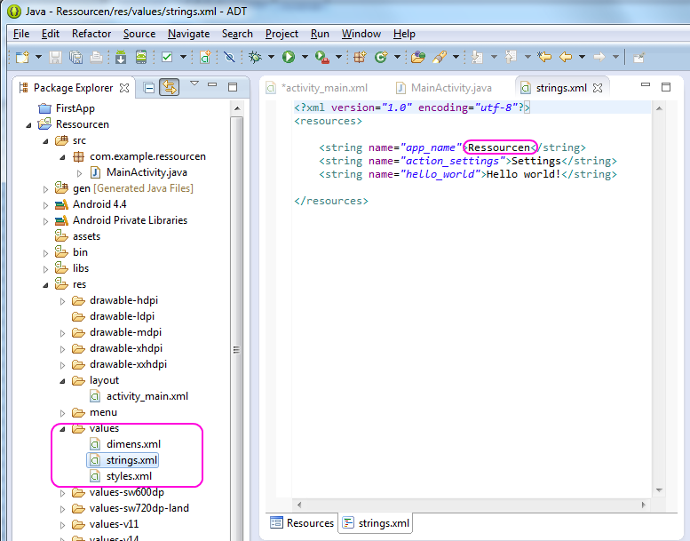
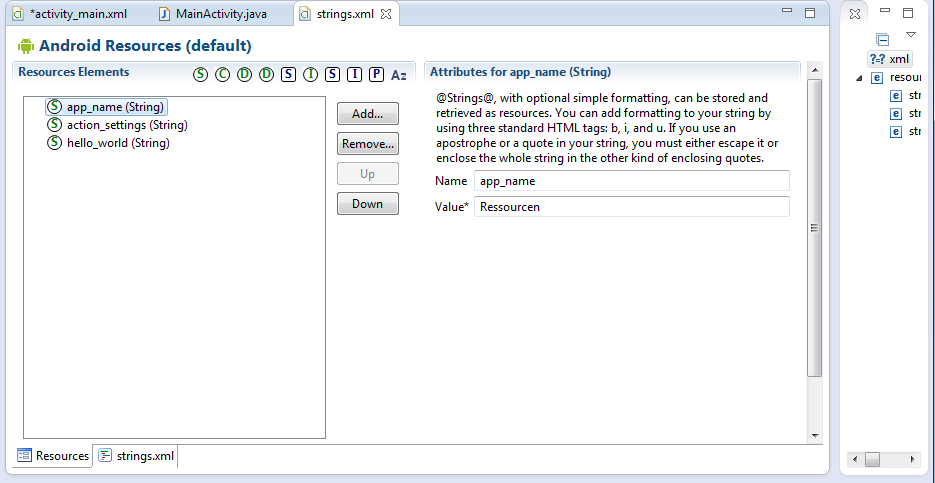
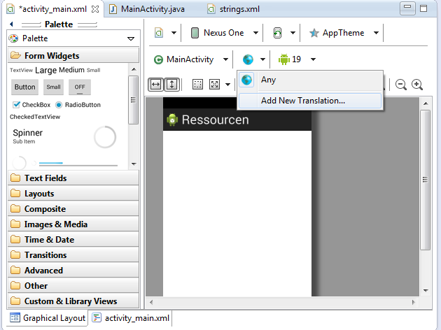
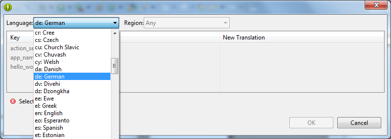
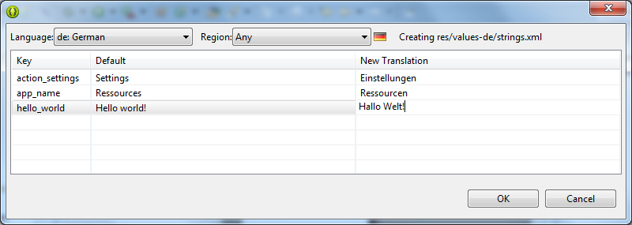
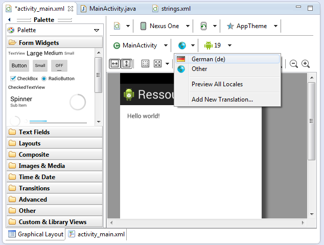
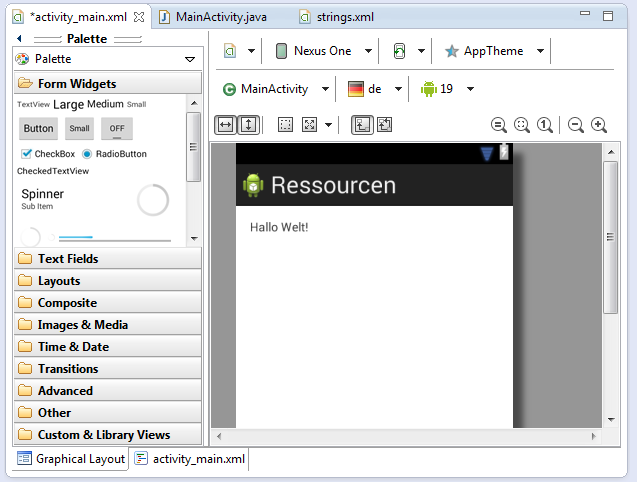

# 5. Ressourcen

Um die Reichweite seiner App zu erhöhen, ist man natürlich gut beraten, diese für einen großen Sprachraum auszulegen.    
Hierbei sind in erste Linie die Wortlaute in den Activities betroffen.  
In dieser App wird gezeigt, wie dies erledigt werden kann.

__Hilfestellung__

Die String-Ressourcen findet Ihr unter  
&nbsp;&nbsp;&nbsp;&nbsp;**res/values/strings.xml**

Dies Ressource-Datei ist zugleich die Default-Ressource-Datei, falls für eine Lokale keine Ressource-Datei auffindbar sein sollte.  
Dies heißt in Klartext, daß der Taliban, dessen Stammessprache wir nicht abbilden können, die App bedauerlicherweise in English ansehen muß.

Ist jedoch für die im Android-Gerät eingestellte Sprache eine Ressource-Datei vorhanden, wird diese Verwendung finden.   

Fangen wir an.

Als erstes den **app_name** angepassen.  
Diese trägt nämlich zur Zeit noch den Namen des Projektes und dieser ist in Deutsch ausformuliert.    
Also 'Ressourcen' bitte in 'Resources' ändern.   

Die Datei 'strings.xml' kann einmal als pure XML-Datei bearbeitet werden oder mehr oder minder komfortabler über 'Resources'.  
Der bevorzugte Editor läßt sich am linken, unteren Rand des Editor-Fensters auswählen.

Um nun eine eigene Ressource zu erstellen, bewegen wir uns zu 
&nbsp;&nbsp;&nbsp;&nbsp;**res/layout/activity_main.xml**
und klicken dort drauf.

Es erscheint das mittlerweile bekannte 'Graphical Layout'.  
Dort auf diese Art 'Weltkugel' klicken und 'Add New Translation' auswählen.

Es erscheint der folgende Dialog:

In diesem Dialog ist als erstes die Auswahlbox 'Language' zu klicken und der gewünschte __Sprachraum__ zu wählen.  
Danach kann bei Bedarf noch eine Region ausgewählt werden.  
Bedauerlicherweise erscheint dort der Länder-Code der ganzen Welt.
Zutreffend wären jedoch für die Lokale 'de' die deutschsprachigen Länder Deutschland, Österreich, Schweiz usw. . Dies ist jedoch nicht gegeben. 

Bringen wir also die deutschen Übersetzungen für die bereits bestehenden Einträge ein.  
Ein Anmerkung : In einer neuen 'Translation' werden nur die Einträge berücksichtigt, welche in der Default-Datei vorhanden sind.  
Kommen nun während der Entwicklungs-Phase neue Einträge hinzu, so sind bereits vorhandene 'Translations' anzupassen. Jedenfalls ist dies so zum Zeitpunkt.  

Nun zum Ausprobieren unserer Übersetzung.

Es wird nun wiederum auf die Weltkugel geklickt.
Dort steht nun ein weiterer Eintrag namens 'de' zur Verfügung.  
Diesen bitte auswählen.

Wie erwartet erscheinen nun die Wortlaute für den deutschen Sprachraum. 

__Was sollten wir jetzt beherrschen?__

- String-Ressourcen für verschiedenlichste Sprach-Räume anlegen zu können
